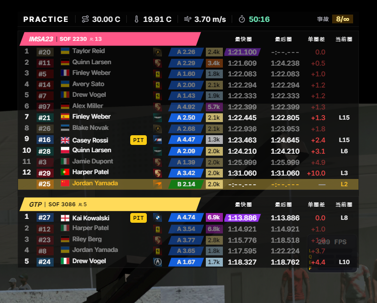
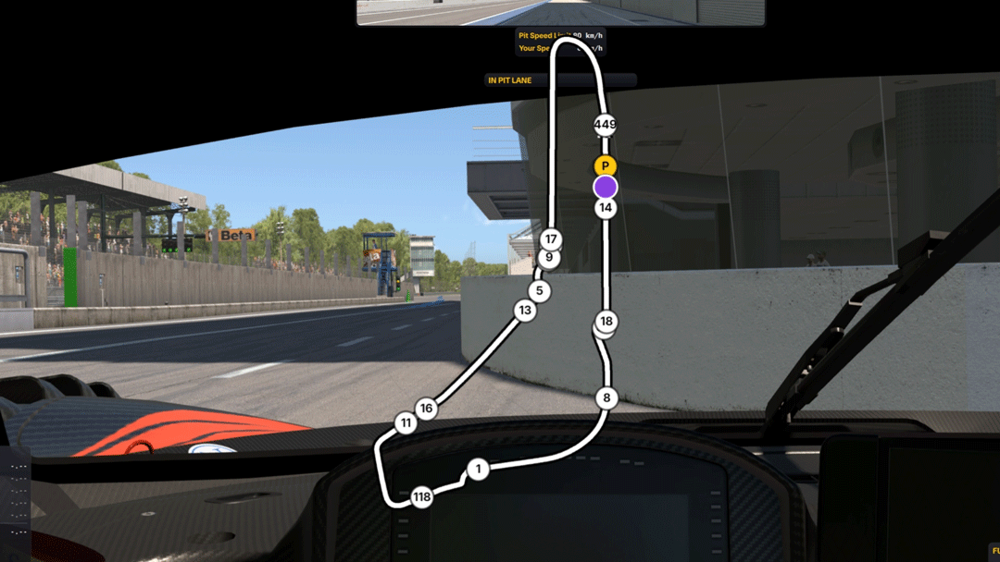
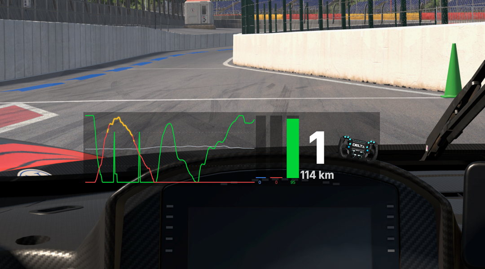
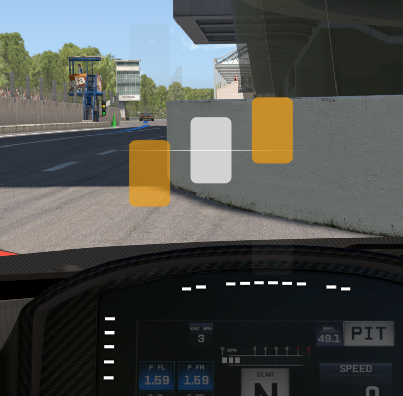

  <b>中文</b> | <a href="README_en.md">English</a>

  

  <strong>驾驶 &middot; 分析 &middot; 提升 &middot; 重复</strong>

  <a href="https://tracklogic.apexracing.cn">官方网站</a> &middot;
  <a href="#快速开始">下载最新版本</a> &middot;
  <a href="#-赞助">☕ 请我喝杯咖啡</a>

---

TrackLogic 是一款免费的 iRacing 第三方遥测插件，提供实时叠加面板，帮助你在比赛中做出更好的决策，赛后进行数据驱动的复盘。

  
   实时排行榜

  
   赛道动态地图

  
   踏板与方向盘

  
   盲区监测

内置算法引擎自动解析轨迹与操作时序，生成直观总结，瞬间定位制动迟疑与走线偏差。

## 快速开始

1. 下载 [Windows 安装程序](apexracing-tracklogic-installer.exe)
2. 启动 iRacing 并进入任意赛道
3. 双击运行 `TrackLogic.exe`
4. 首次使用将引导完成 iRacing OAuth 授权

## 系统要求

- **操作系统**：Windows 10 / 11（64 位）
- **模拟器**：iRacing（已安装并运行）
- **网络**：首次使用需联网完成 iRacing OAuth 绑定

## ☕ 赞助

如果 TrackLogic 帮到了你，请我喝杯咖啡吧！

  

## 免责声明

本软件仅供 iRacing 玩家的数据复盘与技术分享使用。使用本软件产生的任何比赛影响，开发者不承担任何责任。

---

  &copy; 2026 ApexRacing

